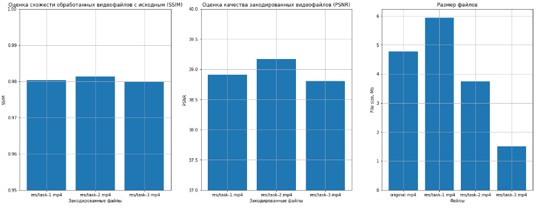

# Лабораторная работа "Видеокодирование" по предмету Кодирование информации
###### Работу выполнил студент 4-го курса МФТИ ФРТК Юрко Максим, Б01-905

## Цель работы
Научиться транскодировать видеопотоки с помощью FFmpeg, ознакомиться с основными опциями FFmpeg, научиться пользоваться справкой по FFmpeg, закрепить знания по теме видеокодирования.

## Используемое оборудование и библиотеки
Для выполнения лабораторной по видеоклированиию был взят видео-фрагмент из мультфильма "Вовка в тридевятом царстве". Лабораторная работа написана на языке программирования Python с использованием библиотек:
- ffmpeg-python - для управления процессом FFmpeg из Python-скрипта
- numpy
- pandas
- matplotlib
- opencv
- json

## Выполнение
#### Задание 1
Для получения фрагмента, закодированного с использованием только предсказания вперед (P-кадры) на один кадр, я использовал ffmeg-команду:
`ffmpeg -y -i input_path -c:v codec -refs 1 -x265-params keyint=2 -coder 0 -bf 0 output_path`, где
- -y - позволяет перезаписать выходной файл, если он уже был создан
- -i - указывает, какой файл мы хотим обработать (`input_path = 'src/original.mp4'`)
- -c:v - задает видеокодек для записи видеопотока в выходной файл, в нашем случае это `libx265`
- -x265-params - устанавливает параметры кодирования x265, такие как интервал ключевых кадров и количество B-кадров, используемых для предсказания
- -coder - задает метод кодирования, здесь нужно было реализовать предсказание вперед только  на один кадр
- -bf - устанавливает количество ожидаемых B-кадров
- `output_path = res/task-1.mp4` - указывается файл для сохранения закодированного фрагмента

Для проверки я вывел инфорамцию о каждом кадре закодированного видео, по которой можно удостовериться, что фрагмент закодирован так, как нам было нужно (I и P -кадры чередуются).

#### Задание 2
Для получения фрагмента, закодированного с использованием только предсказания вперед (P-кадры) на четыре кадра максимально, я использовал следующую ffmpeg-команду:
`ffmpeg -y -i -c:v codec -refs 4 -x265-params keyint=4:bframes=0 -c:a copy output_path`. Главным отличием от предыдущей команды является значение параметра `-refs 4` и `keyint=4`, т.к. нам нужно было получить предсказание на четыре кадра максимально.
Что можно увидеть при проверке закодированного файла `res/task-2.mp4`.

#### Задание 3
Для получения фрагмента, закодированного с использованием только предсказания вперед и назад (P и B -кадры), я использовал команду:
`ffmpeg -y -i -c:v codec -refs 1 -x265-params keyint=24:bframes=2 -c:a copy output_path`. Аналогично предыдущим заданиям при проверке закодированного видео видим, что в файле пристутствуют только P и B -кадры.

#### Задание 4
Для оценки качества полученного видеоряда я использовал метрики SSIM, PSNR и размер файлов.
> Метрика `SSIM (Structural Similarity Index)` показывает степень структурной схожести между двумя изображениями. Она измеряет три аспекта изображения: яркость, контрастность и структуру, и дает оценку на основе этих факторов. SSIM принимает значения от 0 до 1, где 1 означает полное сходство между изображениями.

> Метрика `PSNR (Peak Signal-to-Noise Ratio)` показывает отношение максимального значения сигнала к квадрату среднеквадратической ошибки (MSE) между оригинальным и сжатым видео. Чем выше значение PSNR, тем лучше качество изображения или видео, потому что сжатый сигнал содержит меньше ошибок в сравнении с оригиналом.
 

Для обработки и вычислений всех необходимых параметров каждого кадра, я использовал библиотеку opencv.
Ниже приведена таблица с значениями каждой из метрик.

| Метрика\Файл | original.mp4 | task-1.mp4 | task-2.mp4 | task-3.mp4 |
|:------------:|:------------:|:----------:|:----------:|:----------:|
| SSIM         |    1.0000    |   0.9804   |   0.9814   |   0.9799   |
| PSNR         |              |   38.911   |   39.169   |   38.803   |
| Size         |    4.76 Mb   |   5.94 Mb  |   3.73 Mb  |   1.49 Mb  |

## Выводы
В рамках выполнения этой лабораторной работы я познакомился и научился работать с FFmpeg. Проанализировав получившиеся значения размера файлов и метрик SSIM, PSNR, можно сделать вывод, что при кодировании видео с использованием предсказания
вперед на четыре кадра максимально имеет наилучшее качество и относительно небольшой размер, однако при кодировании видео с использованием только предстазаний только вперед и назад, размер выходного файла получается наименьшим. Это связано с тем,
что B-кадры могут быть восстановлены из предыдущих и следующих кадров, т.е. могут использовать больше информации для сжатия видео, что приводит к меньшему размеру файла.
